# React Polymorph

React Polymorph is a UI framework for React, that separates logic, markup and theming of components.
It's inspired by [react-toolbox](https://github.com/react-toolbox/react-toolbox/) (but more flexible), powered by [CSS Modules](https://github.com/css-modules/css-modules) and harmoniously integrates with
your [webpack](http://webpack.github.io/) workflow, although you can use any other module bundler.

## Why?

* Existing React UI frameworks are too hard to customize.
* Overriding css styles is not enough for complex components.
* You need multiple variations of a component with shared logic.
* You need multiple, completely unique themes for your components.

## How:

Separate monolithic React components into:

1. **Component** (logic) - Only handle UI logic, do not render markup.
2. **Skin** (markup) - Only render the markup, delegate to component.
3. **Theme** (styling) - Only concerned about styling your skin.

## Installation & Usage

React Polymorph can be installed as an [npm package](https://www.npmjs.com/package/react-polymorph):

`$ npm install --save react-polymorph`

### Usage in Webpack Projects

```bash
npm install --save style-loader css-loader sass-loader
```

```js
module: {
  loaders: [
    {
      test: /\.scss$/,
      loaders: [
        'style?sourceMap',
        'css?sourceMap&modules&localIdentName=[name]_[local]&importLoaders=1',
        'sass?sourceMap'
      ]
    },
    // your other loaders …
  ]
},
```

Now you can import and use components like this in your app:

```javascript
import React from "react";
import { Input } from "react-polymorph/lib/components";
import { InputSkin } from "react-polymorph/lib/skins/simple";

// Basic input component:
const MyInput = () => <Input skin={InputSkin} />;
```

Each component's _skin_ that you apply to your component will receive its styles (css/scss) via a _theme_.
React-polymorph comes with Simple themes & skins out of the box, but all themes are completely customizable.

### Components and Skins

Imagine you need a standard text `Input` component for text and a `NumericInput`
for floating point numbers. The only difference is the logic of the component,
in both cases it is "just" an input field showing some text:

#### Standard Input

The standard input is as simple as possible and does not have much logic:

```javascript
import React from "react";
import { Input } from "react-polymorph/lib/components";
import { InputSkin } from "react-polymorph/lib/skins/simple";
import { InputTheme } from "react-polymorph/lib/themes/simple";

// Standard input component:
const MyStandardInput = props => (
  <Input
    label="Input with max. 5 Characters"
    maxLength={5}
    skin={InputSkin}
    theme={InputTheme}
  />
);
```

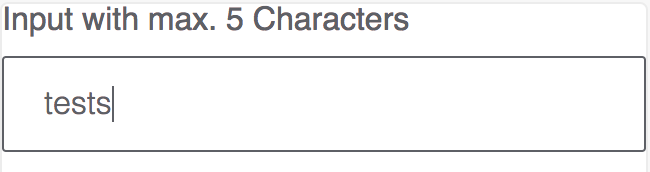

#### Numeric Input

The numeric input however is specialized in guiding the user to
enter correct floating point numbers:

```javascript
import React from "react";
import { NumericInput } from "react-polymorph/lib/components";
import { InputSkin } from "react-polymorph/lib/skins/simple";
import { InputTheme } from "react-polymorph/lib/themes/simple";

const MyNumericInput = props => (
  <NumericInput // notice the different logic component!
    skin={InputSkin} // but the same skin!
    theme={InputTheme}
    label="Amount"
    placeholder="0.000000"
    maxBeforeDot={5}
    maxAfterDot={6}
    maxValue={30000}
    minValue={0.000001}
  />
);
```

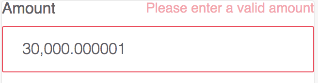

This is a simple example that shows how you can make/use specialized versions
of basic components by composition - a core idea of `react-polymorph`!

#### Textarea

The textarea is as simple as possible and does not have much logic:

```javascript
import React from "react";
import { TextArea } from "react-polymorph/lib/components";
import { TextAreaSkin } from "react-polymorph/lib/skins/simple";
import { TextAreaTheme } from "react-polymorph/lib/themes/simple";

const MyTextArea = props => (
  <TextArea
    label="Textarea with fixed amount of rows to start with"
    placeholder="Your description here"
    rows={5}
    skin={TextAreaSkin}
    theme={TextAreaTheme}
  />
);
```

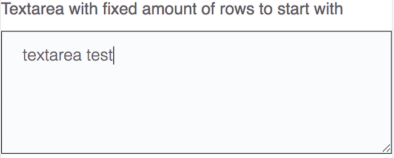

#### Button

The button is as simple as possible and does not have much logic:

```javascript
import React from "react";
import { Button } from "react-polymorph/lib/components";
import { ButtonSkin } from "react-polymorph/lib/skins/simple";
import { ButtonTheme } from "react-polymorph/lib/themes/simple";

const MyButton = props => (
  <Button label="Button label" skin={ButtonSkin} theme={ButtonTheme} />
);
```

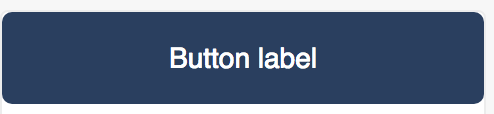

#### Select

The select component is like standard select but with additional logic for adding custom option renderer and opening directions (upward / downward):

```javascript
import React from "react";
import { Select } from "react-polymorph/lib/components";
import { SelectSkin } from "react-polymorph/lib/skins/simple";
import { SelectTheme } from "react-polymorph/lib/themes/simple";

const MySelect = props => (
  <Select
    label="Countries"
    options={OPRIONS_ARRAY}
    optionRenderer={option => {
      return (
        <div className={styles.customOptionStyle}>
          
          <span>{option.label}</span>
        </div>
      );
    }}
    skin={SelectSkin}
    theme-{SelectTheme}
  />
);
```

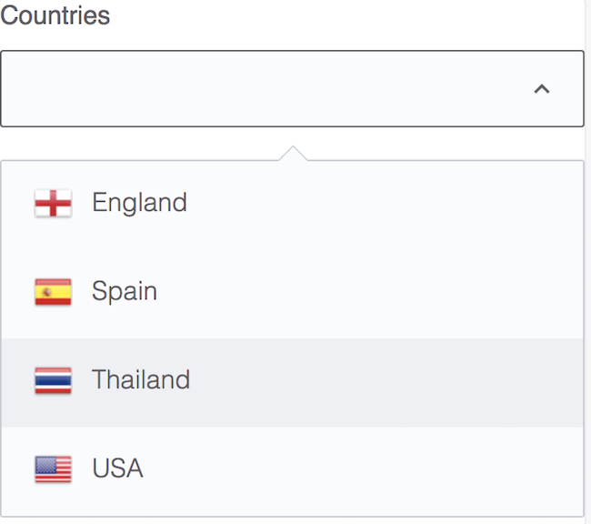

#### Checkbox

The checkbox is as simple as possible and does not have much logic:

```javascript
import React from "react";
import { Checkbox } from "react-polymorph/lib/components";
import { CheckboxSkin } from "react-polymorph/lib/skins/simple";
import { CheckboxTheme } from "react-polymorph/lib/themes/simple";

const MyCheckbox = props => (
  <Checkbox label="My checkbox" skin={CheckboxSkin} theme={CheckboxTheme} />
);
```

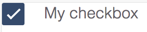

#### Switch

The switch is as simple as possible and does not have much logic. Like checkbox but uses a different skin part:

```javascript
import React from "react";
import { Checkbox } from "react-polymorph/lib/components";
import { SwitchSkin } from "react-polymorph/lib/skins/simple";
import { SwitchTheme } from "react-polymorph/lib/themes/simple";

const MySwitch = props => (
  <Checkbox label="My switch" skin={SwitchSkin} theme={SwitchTheme} />
);
```

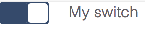

#### Toggler

The toggler is as simple as possible and does not have much logic. Like checkbox but uses a different skin part:

```javascript
import React from "react";
import { Checkbox } from "react-polymorph/lib/components";
import { TogglerSkin } from "react-polymorph/lib/skins/simple";
import { TogglerTheme } from "react-polymorph/lib/themes/simple";

const MyToggler = props => (
  <Checkbox
    labelLeft="Included"
    labelRight="Excluded"
    skin={TogglerSkin}
    theme={TogglerTheme}
  />
);
```

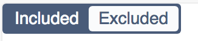

#### Modal

The modal is component which wraps its children as standard dialog. As is shown in example, modal can have multiple other polymorph components:

```javascript
import React from "react";
import { Modal, Button } from "react-polymorph/lib/components";
import { ModalSkin, ButtonSkin } from "react-polymorph/lib/skins/simple";
import { ModalTheme, ButtonTheme } from "react-polymorph/lib/themes/simple";

const MyModal = props => (
  <Modal triggerCloseOnOverlayClick={false} skin={ModalSkin} theme={ModalTheme}>
    <h1 className={styles.modalTitle}>
      Are you sure you want to delete this thing?
    </h1>
    <div className={styles.buttonsContainer}>
      <Button
        label="Cancel"
        onClick={closeModalCallback}
        skin={ButtonSkin}
        theme={ButtonTheme}
      />
      <Button
        label="Delete"
        onClick={closeModalCallback}
        skin={ButtonSkin}
        theme={ButtonTheme}
      />
    </div>
  </Modal>
);
```


#### Autocomplete

The autocomplete input is specialized to help users to select between multiple suggested words depending on entered letters:

```javascript
import React from "react";
import { Autocomplete } from "react-polymorph/lib/components";
import { AutocompleteSkin } from "react-polymorph/lib/skins/simple";
import { AutocompleteTheme } from "react-polymorph/lib/themes/simple";

const MyAutocomplete = props => (
  <Autocomplete
    label="Recovery phrase"
    placeholder="Enter recovery phrase"
    suggestedWords={SUGGESTED_WORDS}
    placeholder="Enter mnemonic..."
    maxSelections={12}
    maxVisibleSuggestions={5}
    invalidCharsRegex={/[^a-zA-Z]/g}
    skin={AutocompleteSkin}
    theme={AutocompleteTheme}
  />
);
```

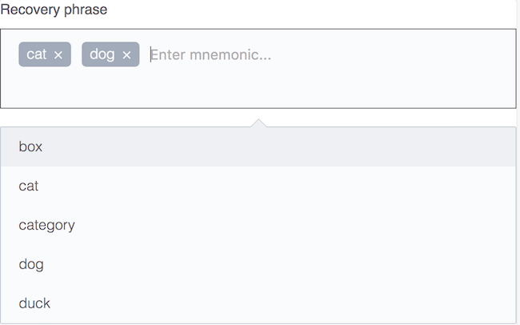

#### Bubble

The bubble component will open up an absolutely positioned speech bubble. This is position in respect to it's closest relatively positioned parent.

```javascript
import React from "react";
import { Bubble } from "react-polymorph/lib/components";
import { BubbleSkin } from "react-polymorph/lib/skins/simple";
import { BubbleTheme } from "react-polymorph/lib/themes/simple";

const MyBubble = props => (
  <div className={{ position: "relative" }}>
    <Bubble skin={BubbleSkin} theme={BubbleTheme}>
      plain bubble
    </Bubble>
  </div>
);
```

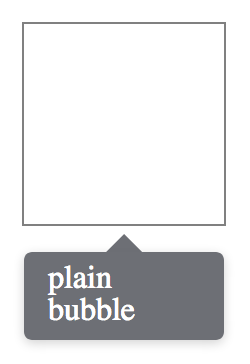

#### Tooltip

The tooltip opens a bubble relative to it's children, containing text or html to display.

```javascript
import React from "react";
import { Tooltip } from "react-polymorph/lib/components";
import { TooltipSkin } from "react-polymorph/lib/skins/simple";
import { TooltipTheme } from "react-polymorph/lib/themes/simple";

const MyTooltip = props => (
  <Tooltip
    tip="Description of the child element"
    skin={TooltipSkin}
    theme={TooltipTheme}
  >
    hover over me
  </Tooltip>
);
```

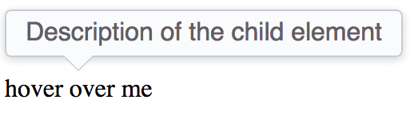

#### Radio

The radio is as simple as possible and does not have much logic:

```javascript
import React from "react";
import { Radio } from "react-polymorph/lib/components";
import { RadioSkin } from "react-polymorph/lib/skins/simple";
import { RadioTheme } from "react-polymorph/lib/themes/simple";

const MyRadio = props => (
  <Radio label="My radio" skin={SimpleRadioSkin} theme={RadioTheme} />
);
```

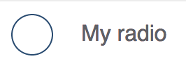

### Customizing Component Skins

#### Theme API

Each component has a theme API. This is a plain object which exposes the shape of a component's theme. Each property on the theme API object is a class name assigned to an element within the component's skin and a class definition within the component's theme. Below is the Button's theme API.

```javascript
{
  root: '',
  disabled: ''
}
```

Every component accepts an optional `themeOverrides` property intended to provide a [CSS Module import object](https://github.com/css-modules/css-modules) which is used by the component to assign a user's local classnames to its DOM nodes. If the component has already been passed a theme prop, the css/scss properties passed via themeOverrides will be merged with the injected theme object. This automatic composition saves the user from manually piecing together custom styles with those of the injected theme that the user may wish to retain. If you want to customize a component's theme, the themeOverrides object must contain the appropriate classname mapping to its documented **theme API**. In this way, you can **add** or **override** classnames on the nodes of a specific component.

### Overriding a styles in a theme

For example, if you want to override the background-color of `Button`'s injected theme with green:

```js
import React from "react";
import { Button } from "react-polymorph/lib/components";
import { ButtonSkin } from "react-polymorph/lib/skins/simple";
import { ButtonTheme } from "react-polymorph/lib/themes/simple";
import themeOverrides from "./GreenButton.css";

const GreenButton = props => (
  <Button
    {...props}
    skin={ButtonSkin}
    theme={ButtonTheme}
    themeOverrides={themeOverrides}
  />
);

export default GreenButton;
```

###### themeOverrides

```css
.root {
  background-color: green;
}
```

###### ButtonTheme

```css
.root {
  background-color: blue;
  color: white;
  border-radius: 5px;
}
```

###### Result

```css
.root {
  background-color: green;
  color: white;
  border-radius: 5px;
}
```

The user's custom background color **overrides** Simple theme's blue background.

### Compose

Similarly, you can compose your own custom styles with an injected theme

###### themeOverrides

```css
.root {
  text-transform: uppercase;
}
```

will be composed with

###### ButtonTheme

```css
.root {
  background-color: blue;
  color: white;
  border-radius: 5px;
}
```

###### Result

```css
.root {
  text-transform: uppercase;
  background-color: blue;
  color: white;
  border-radius: 5px;
}
```

In this case we are **composing** custom styles with an instance of `Button` where the Simple `ButtonTheme` was already injected. If a theme isn't passed to a component, a theme object implementing that component's full theme API is necessary. When implementing a component's full theme, take into account that every classname is there for a reason. You can either provide a component's theme as a prop or pass it through context as described in the next section.

### ThemeProvider HOC

`ThemeProvider` allows you to pass a theme to multiple instances of a component without explicitly passing them a theme prop. Wrap your component tree with `ThemeProvider` at the desired level in your component hierarchy. You can maintain different themes and themeOverrides for specific portions of your app's tree.

```js
import React, { Component } from "react";

// components
import {
  ThemeProvider,
  Modal,
  FormField,
  Input,
  Button
} from "react-polymorph/lib/components";

// skins
import {
  ModalSkin,
  FormFieldSkin,
  InputSkin,
  ButtonSkin
} from "react-polymorph/lib/skins/simple";

// themes
import {
  ModalTheme,
  FormFieldTheme,
  InputTheme,
  ButtonTheme
} from "react-polymorph/lib/themes/simple";

class App extends Component {
  state = {
    isOpen: true,
    value: ""
  };

  setValue = value => this.setState({ value });

  render() {
    const SimpleTheme = {
      modal: { ...ModalTheme },
      formfield: { ...FormFieldTheme },
      input: { ...InputTheme },
      button: { ...ButtonTheme }
    };

    return (
      <ThemeProvider theme={SimpleTheme}>
        <Modal
          isOpen={this.state.isOpen}
          triggerCloseOnOverlayClick={false}
          skin={ModalSkin}
        >
          <div>
            <FormField
              label="FormField in Modal"
              skin={FormFieldSkin}
              render={props => (
                <Input
                  {...props}
                  value={this.state.value}
                  onChange={this.setValue}
                  skin={InputSkin}
                />
              )}
            />
          </div>

          <div>
            <Button
              onClick={this.props.handleClick}
              className="primary"
              label="Submit"
              skin={ButtonSkin}
            />
          </div>
        </Modal>
      </ThemeProvider>
    );
  }
}
export default App;
```

### Customizing all instances of a Component using ThemeProvider

Create a CSS Module theme file for the component you wish to customize, for example for `Input` & `FormField`:

###### input.css

```css
.input {
  width: 25%;
}

.input:focus {
  border-color: green;
  width: 50%;
}

.input:hover {
  border-color: green;
}
```

###### formfield.css

```css
.label {
  color: green;
  font-family: "Lato", sans-serif;
}
```

Create a theme file that imports each component's custom styles as CSS-Modules object(s). Apply the styles according to the root theme API structure. The root theme API is simply an object whose keys are named after each component in the react-polymorph library. For example, the styles you assign to the input key will be applied to all instances of the `Input` component nested within `ThemeProvider`. The same goes for the formfield key and all nested instances of the `FormField` component.

###### customInputs.js

```js
import MyCustomInputTheme from "./css/input.css";
import MyCustomFormFieldTheme from "./css/formfield.css";

export default {
  input: MyCustomInputTheme,
  formfield: MyCustomFormFieldTheme
};
```

Import your custom theme to pass `ThemeProvider`'s themeOverrides property. This will apply your custom css/scss to **all** of its nested react-polymorph components. In this example, all 3 instances of the `Input` and `FormField` components will have the user's custom css definitions composed with Simple InputTheme and FormFieldTheme.

```js
import React from "react";

// components
import {
  ThemeProvider,
  FormField,
  Input,
  NumericInput
} from "react-polymorph/lib/components";

// skins
import { FormFieldSkin, InputSkin } from "react-polymorph/lib/skins/simple";

// themes
import { FormFieldTheme, InputTheme } from "react-polymorph/lib/themes/simple";

// the user's custom Input and FormField styles
import CustomInputsTheme from "./styles/customInputs.js";

const CustomInputs = props => {
  const SimpleTheme = {
    input: { ...InputTheme },
    formfield: { ...FormFieldTheme }
  };

  return (
    <ThemeProvider themeOverrides={CustomInputsTheme} theme={SimpleTheme}>
      <FormField
        label="Recipient's First Name"
        skin={FormFieldSkin}
        render={props => (
          <Input {...props} placeholder="Avery" skin={InputSkin} />
        )}
      />

      <FormField
        label="Recipient's Last Name"
        skin={FormFieldSkin}
        render={props => (
          <Input {...props} placeholder="McKenna" skin={InputSkin} />
        )}
      />

      <FormField
        label="Amount to Send"
        skin={FormFieldSkin}
        render={props => (
          <NumericInput {...props} placeholder="10.000" skin={InputSkin} />
        )}
      />
    </ThemeProvider>
  );
};

export default CustomInputs;
```

You may also pass the entire SimpleTheme object to `ThemeProvider` and maintain the same functionality without having to import themes specific to the components you're using.

```js
import React from "react";

// components
import { ThemeProvider } from "react-polymorph/lib/components";

// themes
import { SimpleTheme } from "react-polymorph/lib/themes/simple";

const App = () => (
  <ThemeProvider theme={SimpleTheme}>
    <div>...</div>
  </ThemeProvider>
);

export default App;
```
